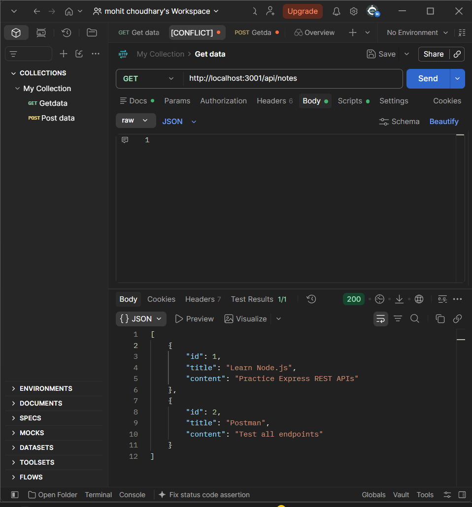
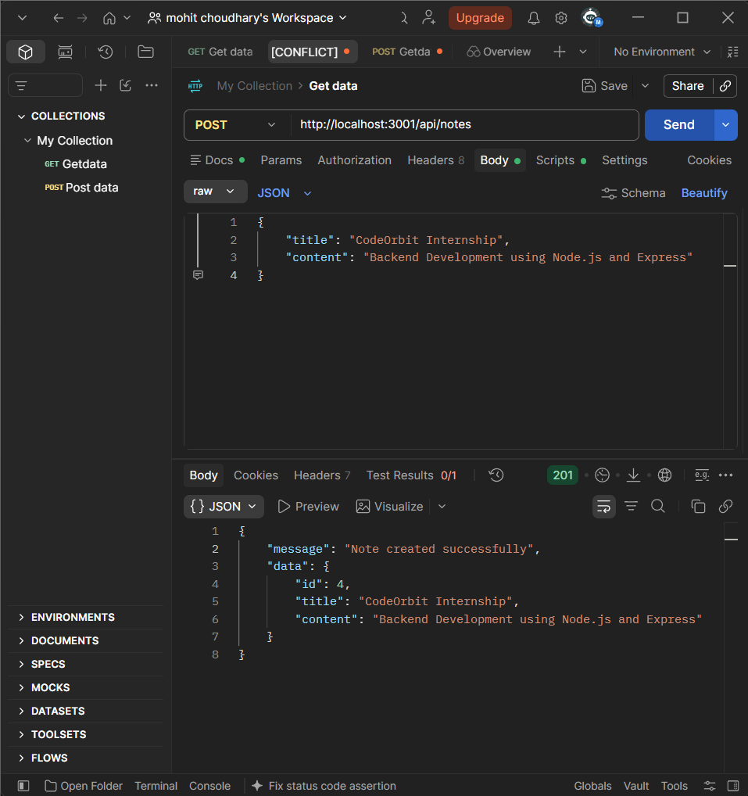
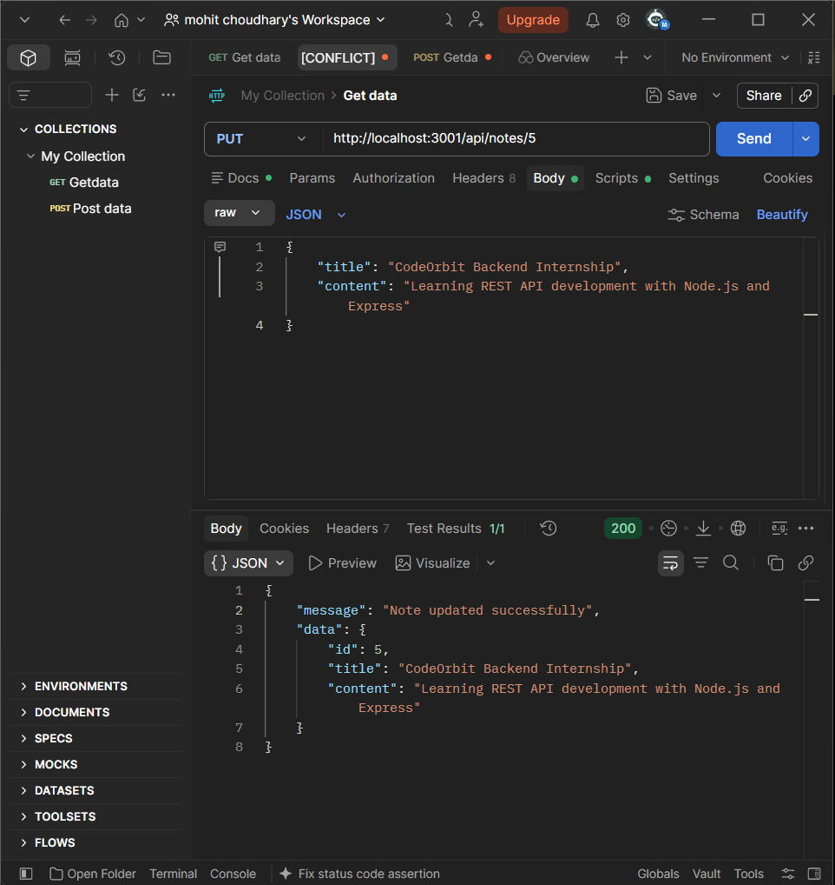

# CodeOrbit Tech — Simple REST API

A beginner-friendly REST API developed using **Node.js and Express.js** as part of the **CodeOrbit Tech Backend Development Internship**.

This project demonstrates the basic concepts of backend development and RESTful API design by implementing CRUD-style operations for managing simple notes.

---

## 📌 Internship Information

**Organization:** CodeOrbit Tech  
**Internship Domain:** Backend Development  
**Project:** Simple REST API  
**Technology:** Node.js + Express.js  
**API Testing:** Postman  
**Storage:** In-memory JavaScript array  

---

## 📖 Project Overview

The purpose of this project is to build a simple backend REST API using **Node.js and Express.js**.

The API allows users to create, read, update, and delete notes through HTTP requests.

The project uses an **in-memory array** for storing the notes, so no external database is required.

The API can be tested using **Postman**.

---

## 🚀 Features

- Create a new note
- Get all notes
- Get a single note by ID
- Update an existing note
- Delete a note
- Basic request validation
- Proper HTTP status codes
- JSON request and response format
- RESTful API endpoints
- Postman API testing
- Simple and beginner-friendly project structure

---

## 🛠️ Technologies Used

| Technology | Purpose |
|---|---|
| Node.js | JavaScript runtime environment |
| Express.js | Backend web framework |
| JavaScript | Application programming language |
| Postman | API testing |
| Git | Version control |
| GitHub | Source code hosting |

---

## 📂 Folder Structure

```text
CodeOrbit-Simple-REST-API/
│
├── screenshots/
│   ├── 01-get-all-notes.png
│   ├── 02-get-single-note.png
│   ├── 03-post-create-note.png
│   ├── 04-put-update-note.png
│   └── 05-delete-note.png
│
├── .gitignore
├── package.json
├── package-lock.json
├── README.md
└── server.js
```

### File Description

**server.js**

Contains the Express server and all REST API endpoints.

**package.json**

Contains project information, dependencies, and npm scripts.

**package-lock.json**

Stores the exact dependency versions installed for the project.

**screenshots/**

Contains screenshots showing successful API testing using Postman.

**README.md**

Contains project documentation, setup instructions, API details, and usage information.

**.gitignore**

Prevents files such as `node_modules` and `.env` from being uploaded to GitHub.

---

# 🔗 API Endpoints

The server runs on:

```text
http://localhost:3001
```

## 1. Get All Notes

### Request

```http
GET /api/notes
```

### URL

```text
http://localhost:3001/api/notes
```

### Description

Returns all available notes.

### Example Response

```json
[
  {
    "id": 1,
    "title": "Learn Node.js",
    "content": "Practice Express REST APIs"
  },
  {
    "id": 2,
    "title": "Postman",
    "content": "Test all endpoints"
  }
]
```

### Status Code

```text
200 OK
```

---

## 2. Get Note by ID

### Request

```http
GET /api/notes/:id
```

### Example

```text
http://localhost:3001/api/notes/1
```

### Example Response

```json
{
  "id": 1,
  "title": "Learn Node.js",
  "content": "Practice Express REST APIs"
}
```

### Status Code

```text
200 OK
```

If the note does not exist:

```text
404 Not Found
```

---

# 3. Create a New Note

### Request

```http
POST /api/notes
```

### URL

```text
http://localhost:3001/api/notes
```

### Request Body

```json
{
  "title": "CodeOrbit Internship",
  "content": "Backend Development using Node.js and Express"
}
```

### Example Response

```json
{
  "message": "Note created successfully",
  "data": {
    "id": 3,
    "title": "CodeOrbit Internship",
    "content": "Backend Development using Node.js and Express"
  }
}
```

### Status Code

```text
201 Created
```

---

# 4. Update a Note

### Request

```http
PUT /api/notes/:id
```

### Example URL

```text
http://localhost:3001/api/notes/3
```

### Request Body

```json
{
  "title": "CodeOrbit Backend Internship",
  "content": "Learning REST API development with Node.js and Express"
}
```

### Example Response

```json
{
  "message": "Note updated successfully",
  "data": {
    "id": 3,
    "title": "CodeOrbit Backend Internship",
    "content": "Learning REST API development with Node.js and Express"
  }
}
```

### Status Code

```text
200 OK
```

---

# 5. Delete a Note

### Request

```http
DELETE /api/notes/:id
```

### Example URL

```text
http://localhost:3001/api/notes/3
```

### Example Response

```json
{
  "message": "Note deleted successfully",
  "data": {
    "id": 3,
    "title": "CodeOrbit Backend Internship",
    "content": "Learning REST API development with Node.js and Express"
  }
}
```

### Status Code

```text
200 OK
```

---

# 📊 HTTP Methods Used

| HTTP Method | Operation | Endpoint |
|---|---|---|
| GET | Get all notes | `/api/notes` |
| GET | Get single note | `/api/notes/:id` |
| POST | Create note | `/api/notes` |
| PUT | Update note | `/api/notes/:id` |
| DELETE | Delete note | `/api/notes/:id` |

---

# 🧪 Testing with Postman

All API endpoints were tested using **Postman**.

The following operations were tested successfully:

- GET all notes
- GET a single note
- POST a new note
- PUT/update a note
- DELETE a note

Screenshots of the API testing are included in the `screenshots` folder.

---

# 📸 Postman Screenshots

## GET — All Notes



---

## GET — Single Note


---

## POST — Create Note



---

## PUT — Update Note



---

## DELETE — Delete Note


---

# ⚙️ Installation and Setup

## Step 1 — Clone the repository

```bash
git clone https://github.com/YOUR_GITHUB_USERNAME/CodeOrbit-Simple-REST-API.git
```

## Step 2 — Navigate to the project

```bash
cd CodeOrbit-Simple-REST-API
```

## Step 3 — Install dependencies

```bash
npm install
```

## Step 4 — Start the server

```bash
npm start
```

The server will start at:

```text
http://localhost:3001
```

---

# ▶️ Running the Project

After starting the server, open Postman and use the API endpoints documented above.

Example:

```text
GET http://localhost:3001/api/notes
```

---

# 💾 Data Storage

This project uses an **in-memory JavaScript array** to store notes.

Example:

```javascript
let notes = [
    {
        id: 1,
        title: "Learn Node.js",
        content: "Practice Express REST APIs"
    }
];
```

Because the project uses in-memory storage, the data will reset when the server is restarted.

No external database is required for this project.

---

# 🔐 Validation and Error Handling

The API performs basic validation for required fields.

For example, when creating a note, both `title` and `content` are required.

If required data is missing, the API returns:

```json
{
  "message": "title and content are required"
}
```

with:

```text
400 Bad Request
```

If a requested note does not exist:

```text
404 Not Found
```

---

# 📈 Project Learning Outcomes

Through this project, I practiced:

- Node.js backend development
- Express.js
- REST API design
- HTTP methods
- HTTP status codes
- JSON request/response handling
- API validation
- CRUD operations
- Postman API testing
- Git and GitHub
- Backend project documentation

---

# 🎯 Internship Task

This project was completed as part of the:

**CodeOrbit Tech — Backend Development Internship**

The project demonstrates practical backend development concepts using Node.js and Express.js.

---

# 🔗 GitHub Repository

**Repository:**

https://github.com/YOUR_GITHUB_USERNAME/CodeOrbit-Simple-REST-API

---

# 👨‍💻 Author

**Mohit Choudhary**

Backend Development Intern

---

## 📌 Project Status

**Completed ✅**

- REST API implemented
- CRUD operations implemented
- Postman testing completed
- Project documented
- Source code uploaded to GitHub

---

## 📄 License

This project was created for educational and internship purposes.